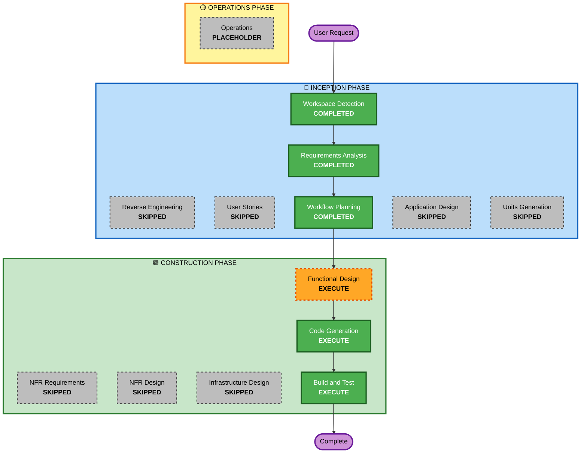

# Execution Plan — Classification Agent

## Detailed Analysis Summary

### Change Impact Assessment
- **User-facing changes**: Yes — pipeline now classifies and moves files to Obsidian vault automatically
- **Structural changes**: Yes — new `classification.py` module; `ExtractionAgent` renamed to `Extractor`
- **Data model changes**: No — existing `CompactArtifact` / `EnrichedDocument` unchanged
- **API changes**: No — CLI interface unchanged (`docs-extraction --input --output`); `OBSIDIAN_VAULT_PATH` env var added
- **NFR impact**: Minimal — adds one Anthropic API call per extracted file

### Component Relationships
- **Primary changes**: `src/pipeline/classification.py` (new), `src/pipeline/extraction.py` (rename only)
- **Integration point**: `src/pipeline/main.py` — calls `ClassificationAgent` after each extraction
- **Shared utilities**: `src/pipeline/scratchpad.py` — used unchanged for logging
- **Tests**: `tests/unit/test_extraction.py` — rename reference; new `tests/unit/test_classification.py`

### Risk Assessment
- **Risk Level**: Low
- **Rollback Complexity**: Easy — new file can be deleted, rename is trivially reversible
- **Testing Complexity**: Moderate — Anthropic client must be mocked

---

## Workflow Visualization



### Text Alternative

```
INCEPTION PHASE
  [x] Workspace Detection     — COMPLETED
  [ ] Reverse Engineering     — SKIPPED (brownfield artifacts exist and are current)
  [x] Requirements Analysis   — COMPLETED
  [ ] User Stories            — SKIPPED (single developer CLI tool, requirements fully clear)
  [x] Workflow Planning       — COMPLETED (this document)
  [ ] Application Design      — SKIPPED (component structure clear from requirements)
  [ ] Units Generation        — SKIPPED (single cohesive unit of work)

CONSTRUCTION PHASE
  [ ] Functional Design       — EXECUTE (classification prompt + tool schema + error flow)
  [ ] NFR Requirements        — SKIPPED (NFRs fully captured in requirements)
  [ ] NFR Design              — SKIPPED (no new NFR patterns needed)
  [ ] Infrastructure Design   — SKIPPED (no cloud/deployment changes)
  [ ] Code Generation         — EXECUTE (always)
  [ ] Build and Test          — EXECUTE (always)

OPERATIONS PHASE
  [ ] Operations              — PLACEHOLDER
```

---

## Phases to Execute

### INCEPTION PHASE
- [x] Workspace Detection — COMPLETED
- [x] Reverse Engineering — SKIPPED (brownfield artifacts current)
- [x] Requirements Analysis — COMPLETED
- [ ] User Stories — SKIPPED
  - **Rationale**: Single developer CLI tool; requirements are unambiguous; no personas or acceptance criteria needed
- [x] Workflow Planning — COMPLETED (this document)
- [ ] Application Design — SKIPPED
  - **Rationale**: New component (`ClassificationAgent`) is well-defined by requirements; no ambiguous component boundaries or service-layer design decisions
- [ ] Units Generation — SKIPPED
  - **Rationale**: All changes form one cohesive unit — rename + new agent + pipeline integration

### CONSTRUCTION PHASE (Unit: Classification Agent)
- [ ] Functional Design — **EXECUTE**
  - **Rationale**: Classification prompt template, `move_to_vault` tool schema, and error handling flow need explicit design before code generation
- [ ] NFR Requirements — SKIPPED
  - **Rationale**: All NFRs captured in requirements (model tier, 500-char cap, error isolation)
- [ ] NFR Design — SKIPPED (NFR Requirements skipped)
- [ ] Infrastructure Design — SKIPPED
  - **Rationale**: No cloud resources, no deployment changes; only local file I/O
- [ ] Code Generation — **EXECUTE** (always)
- [ ] Build and Test — **EXECUTE** (always)

### OPERATIONS PHASE
- [ ] Operations — PLACEHOLDER

---

## Files Affected

| File | Change Type |
|---|---|
| `src/pipeline/extraction.py` | Rename `ExtractionAgent` → `Extractor` |
| `src/pipeline/classification.py` | New file — `ClassificationAgent` |
| `src/pipeline/main.py` | Integrate `ClassificationAgent` after extraction |
| `tests/unit/test_extraction.py` | Update renamed class reference |
| `tests/unit/test_classification.py` | New file — unit tests for `ClassificationAgent` |

---

## Success Criteria
- `ExtractionAgent` renamed to `Extractor` with all references updated
- `ClassificationAgent` classifies a .md file and moves it to the correct Obsidian vault folder
- Files that cannot be classified remain in the output folder with a WARN log entry
- Missing `OBSIDIAN_VAULT_PATH` degrades gracefully (extraction still completes)
- All existing tests pass; new tests cover classification happy path and failure modes
