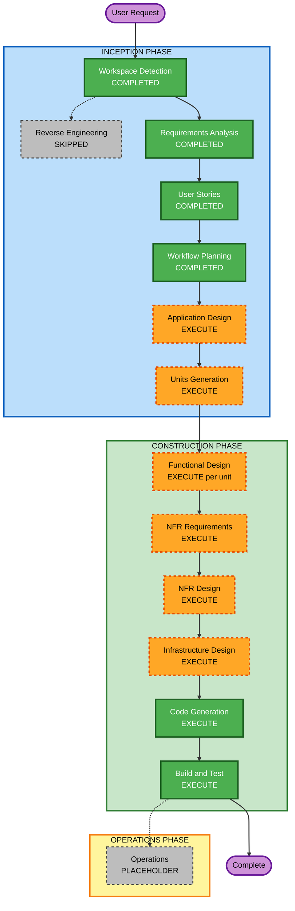

# Execution Plan — Extraction Pipeline

## Detailed Analysis Summary

### Change Impact Assessment
- **User-facing changes**: Yes — new vault `.md` files, new images folder, scratchpad log
- **Structural changes**: Yes — entire new system with 5 agent components
- **Data model changes**: Yes — compact artifact schema, manifest JSON schema, YAML frontmatter schema
- **API changes**: Yes — Google Drive API (MCP), Claude API (Haiku 4.5 + Sonnet 4.5)
- **NFR impact**: Yes — token efficiency (no raw images to LLM), asyncio concurrency, idempotency

### Risk Assessment
- **Risk Level**: Medium
- **Rationale**: Multi-component async system with external API dependencies (Google Drive, Claude). Personal tool scope limits blast radius. Well-defined requirements and user stories reduce ambiguity risk.
- **Rollback Complexity**: Easy — personal tool, no production deployment, files can be deleted and re-run
- **Testing Complexity**: Moderate — async agents require mocking, file system and API interactions need integration tests

---

## Workflow Visualization



### Text Alternative
```
INCEPTION PHASE
  - Workspace Detection    [COMPLETED]
  - Reverse Engineering    [SKIPPED — greenfield]
  - Requirements Analysis  [COMPLETED]
  - User Stories           [COMPLETED]
  - Workflow Planning      [COMPLETED]
  - Application Design     [EXECUTE]
  - Units Generation       [EXECUTE]

CONSTRUCTION PHASE (per-unit loop)
  - Functional Design      [EXECUTE — per unit]
  - NFR Requirements       [EXECUTE]
  - NFR Design             [EXECUTE]
  - Infrastructure Design  [EXECUTE]
  - Code Generation        [EXECUTE — always]
  - Build and Test         [EXECUTE — always]

OPERATIONS PHASE
  - Operations             [PLACEHOLDER]
```

---

## Phases to Execute

### INCEPTION PHASE
- [x] Workspace Detection — COMPLETED
- [x] Reverse Engineering — SKIPPED (greenfield, no existing codebase)
- [x] Requirements Analysis — COMPLETED
- [x] User Stories — COMPLETED
- [x] Workflow Planning — IN PROGRESS
- [ ] Application Design — **EXECUTE**
  - **Rationale**: 5 new agent components (Coordinator, Ingestion, Extraction, Analysis, Export) with inter-component handoff contracts and a compact artifact data schema to define
- [ ] Units Generation — **EXECUTE**
  - **Rationale**: Multi-agent system naturally decomposes into independent units; parallel development is viable; each agent has distinct responsibilities and can be built and tested in isolation

### CONSTRUCTION PHASE (per-unit loop)
- [ ] Functional Design — **EXECUTE per unit**
  - **Rationale**: New data models (compact artifact, manifest schema, YAML frontmatter), complex business logic per agent (eligibility rule, category classification, handoff validation)
- [ ] NFR Requirements — **EXECUTE**
  - **Rationale**: Concurrency model selection (asyncio), token budget constraints, Python library selection (anthropic SDK, google-auth, python-docx, pypdf), Hypothesis for PBT
- [ ] NFR Design — **EXECUTE**
  - **Rationale**: NFR Requirements executed; asyncio patterns, rate-limit backoff design, and PBT test structure need to be incorporated into the design
- [ ] Infrastructure Design — **EXECUTE**
  - **Rationale**: Windows Task Scheduler setup, file system path configuration, Google Drive MCP integration mapping, OAuth token storage location
- [ ] Code Generation — **EXECUTE** (ALWAYS)
- [ ] Build and Test — **EXECUTE** (ALWAYS)

### OPERATIONS PHASE
- [ ] Operations — PLACEHOLDER

---

## Success Criteria
- **Primary Goal**: Fully functional extraction pipeline running as Windows Task Scheduler task
- **Key Deliverables**:
  - Python asyncio pipeline with Coordinator, Ingestion, Extraction, Analysis, Export agents
  - Google Drive OAuth integration via Drive MCP
  - JSON manifest for idempotent state tracking
  - Vault `.md` files with YAML frontmatter, abstract, formatting, citations
  - Images moved to dedicated folder with absolute local URIs in Markdown
  - Scratchpad log capturing all pipeline events
  - Unit tests + property-based tests (Hypothesis, partial enforcement)
  - Windows Task Scheduler configuration instructions
- **Quality Gates**:
  - All 8 user stories with passing acceptance criteria tests
  - No raw image data or base64 in any LLM prompt
  - Re-run safety verified via idempotency tests
  - PBT rules PBT-02, PBT-03, PBT-07, PBT-08, PBT-09 compliant
